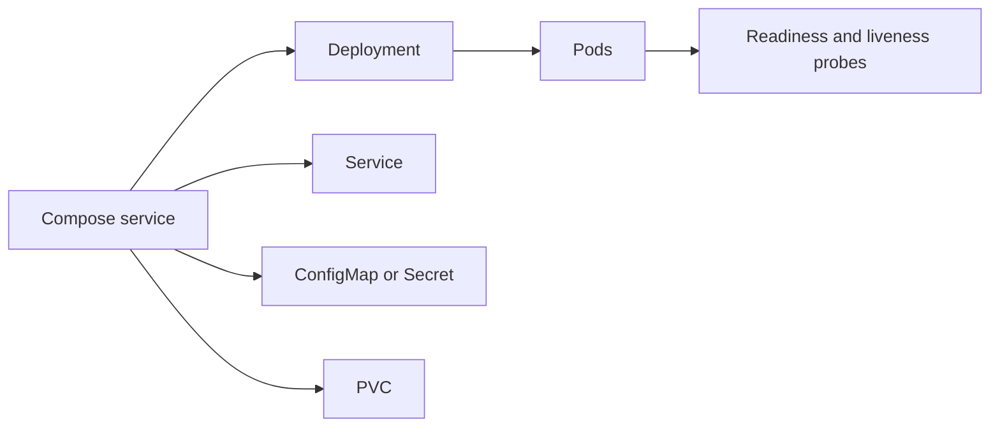

# Compose to Kubernetes map

Use this map to show why one Compose block often expands into several cluster resources with different responsibilities.

```mermaid
flowchart LR
  A["Compose service"] --> B["Deployment"]
  A --> C["Service"]
  A --> D["ConfigMap or Secret"]
  A --> E["PVC"]
  B --> F["Pods"]
  F --> G["Readiness and liveness probes"]
```
